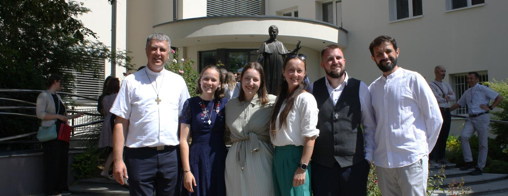

 

# Afrika si ma zavolala

## Ako som sa dostala k misii?

Ahojte,  
volám sa Paula, mám 25 rokov a študujem učiteľstvo primárneho vzdelávania. Už od základnej školy som postupne prichádzala k tomu, že ma napĺňa venovať sa deťom a mládeži. Ako stredoškoláčka som začala animovať tábory a viesť krúžky v centre voľného času. Cez organizáciu VIDES som sa neskôr dostala do rómskej osady na Poštárku, kde som pocítila prvý dotyk misie. Verím, že každé dieťa by malo mať možnosť na vzdelanie a sebarozvoj. Postupom času začala vo mne rásť túžba po misii v Afrike. Táto túžba sa stáva skutočnosťou a ja budem najbližší rok pomáhať v saleziánskej škole v Angole. Saleziánske motto: „DÁVAM ĎALEJ, ČO SOM DOSTAL“ je niečo, čo by som si chcela niesť so sebou celú misiu. Ja som dostala veľa na Slovensku a teraz to chcem zobrať a priniesť tam.

## Čo budem robiť v Afrike?

Prostredníctvom misijnej organizácie SAVIO, o. z., budem na tomto mieste pomáhať deťom pri vzdelávaní a voľnočasových aktivitách – v škole, ktorej cieľom je dať chlapcom a dievčatám z chudobných rodín v slume a z ulice dôstojnejšiu budúcnosť. Úroveň gramotnosti v Angole je len 72%, preto je veľmi dôležité, aby mali deti vytvorené prostredie, v ktorom môžu rásť, vzdelávať sa a vymaniť sa tak z chudoby.

## Aká je Angola?

V Angole dlhé roky panovala občianska vojna. Dnes to tak, našťastie, už nie je. No napriek tomu tu stále vládne veľká chudoba, negramotnosť a nezamestnanosť. Sieť domovov Dona Bosca poskytuje rôzne programy, ktoré reagujú na potreby detí žijúcich v slume a na ulici. Prvý kontakt saleziánskych misionárov s deťmi začína priamo v uliciach hlavného mesta Luanda. Ponúkajú im útočisko a možnosť vzdelávať sa.

## Prečo potrebujem vašu pomoc?

Ako misijná dobrovoľníčka nebudem dostávať za moju prácu žiadnu finančnú odmenu. Aby som vedela túto službu vykonávať, budem potrebovať vašu pomoc. Budem veľmi vďačná za každú finančnú podporu. Vaše dary mi pomôžu pokryť tento rok a ja budem môcť odvážnejšie vykročiť v ústrety tomuto dobrodružstvu v Afrike, ktorá si ma zavolala.

Ak by ste sa chceli stať súčasťou tohto dobrodružstva, dostávať bližšie informácie z miesta môjho pôsobiska a sledovať moju misiu v Angole, môžete mi zaslať svoju emailovú adresu na paula.v.afrike@gmail.com a ja Vás budem pravidelne informovať.

Paulína Hírešová

<a href="https://www.facebook.com/sharer/sharer.php?u=https://jan-revay.github.io/PaulaVAfrike-Jekyll-minimal/" 
 target="_blank" 
 rel="noopener noreferrer"
 style="display:inline-block; padding:10px 20px; background:#1877f2; color:white; border-radius:6px; text-decoration:none; font-weight:bold;">
 Share on Facebook
</a>

{:.donated}
| Už darovali  |                   |       |
|:-------------|:------------------|:------|
| ok           | good swedish fish | nice  |
| out of stock | good and plenty   | nice  |
| ok           | good `oreos`      | hmm   |
| ok           | good `zoute` drop | yumm  |

 
 
 
 

        
Už darovali

      <table class="donated__table">
            <tbody><tr class="donated__row">
            <td class="donated__col">Anonymný podporovateľ</td>
            <td class="donated__col">👏</td>
            <td class="donated__col">
                      10 €
                    </td>
          </tr>
            <tr class="donated__row">
            <td class="donated__col">Paulína Kamenická</td>
             <td class="donated__col">Drž sa ❤️ </td>
            <td class="donated__col">
                      10 €
                    </td>
          </tr>
            <tr class="donated__row">
            <td class="donated__col">Mária Farská</td>
             <td class="donated__col">Si inšpiráciou❤️ </td>
            <td class="donated__col">
                      5 €
                    </td>
          </tr>
            <tr class="donated__row">
            <td class="donated__col">Veronika Jankechová</td>
             <td class="donated__col">Drž sa tam :) </td>
            <td class="donated__col">
                      20 €
                    </td>
          </tr>
            <tr class="donated__row">
            <td class="donated__col">Anonymný podporovateľ</td>
             <td class="donated__col">Všetko najlepšie Pauli ❤️ </td>
            <td class="donated__col">
                      50 €
                    </td>
          </tr>
        <tr class="donated__row">
            <td class="donated__col">Majka S.</td>
             <td class="donated__col"> </td>
            <td class="donated__col">
                      100 €
                    </td>
          </tr>
        <tr class="donated__row">
            <td class="donated__col">Maťka a Janík</td>
             <td class="donated__col"></td>
            <td class="donated__col">
                      60 €
                    </td>
          </tr>
        </tbody></table>
        

            
            <i class="icon-arrow-back"></i>
          
        

          17 darov
        

            <a href="#" class="donated__control-next donated__control-icon " data-page="2">
            <i class="icon-arrow-forward"></i>
          </a>
        

 <ul>
 
   <li>
     <a href="https://github.com/{{ member.github }}">
       {{ member.name }}
     </a>
   </li>
 
 </ul>

---------------------------------------

 
 

Už darovali FINAL

<table class="donated__table">
      <tbody>
  
    <tr class="donated__row">
      <td class="donated__col">{{ darca.meno }}   </td>
      <td class="donated__col">{{ darca.sprava }} </td>
      <td class="donated__col">{{ darca.suma }} € </td>
    </tr>
  
  </tbody></table>

  

        
        <i class="icon-arrow-back"></i>
        
        

          {{ site.data.darcovia | size }} darov
        

        <a href="#" class="donated__control-next donated__control-icon " data-page="2">
        <i class="icon-arrow-forward"></i>
        </a>
  

